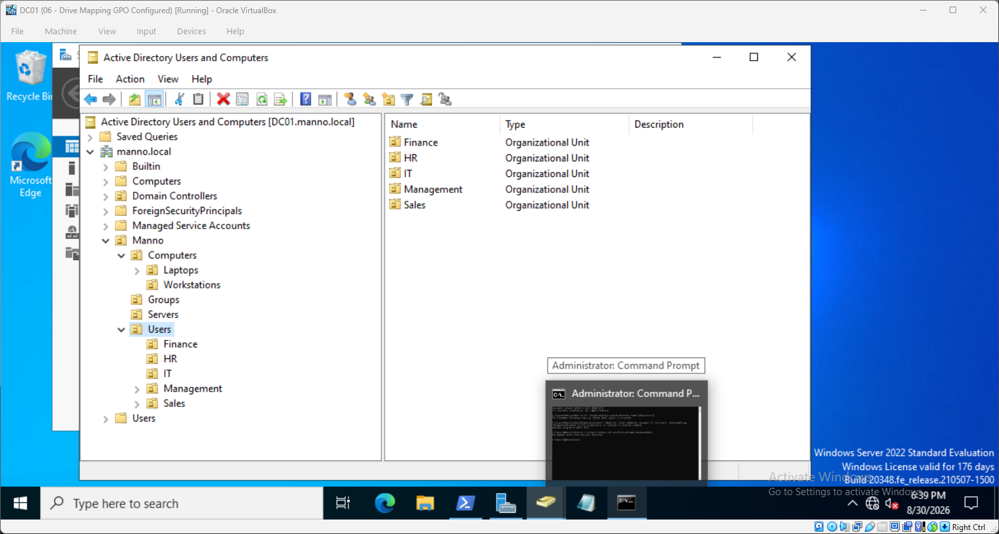
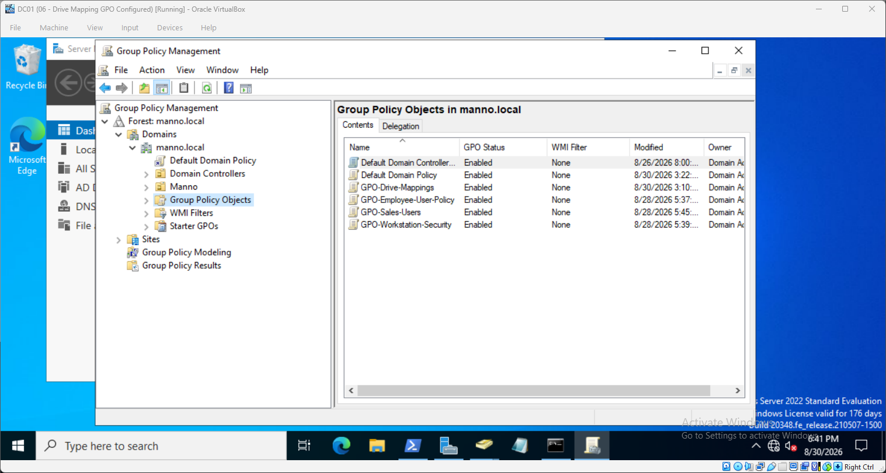
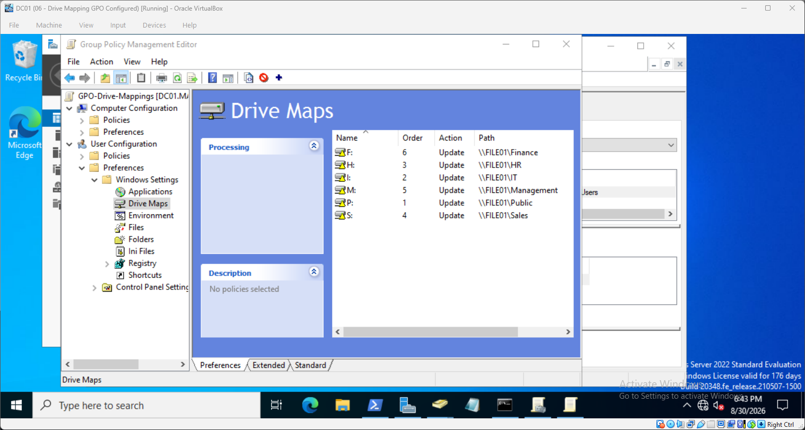
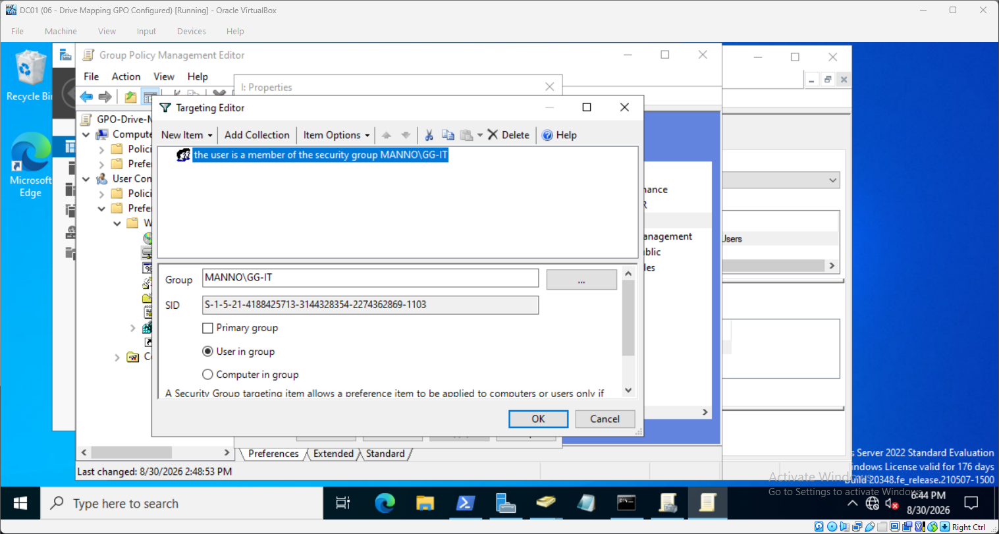
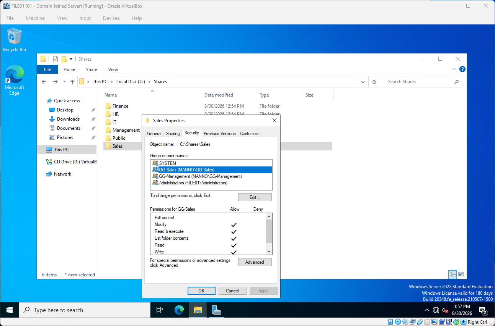
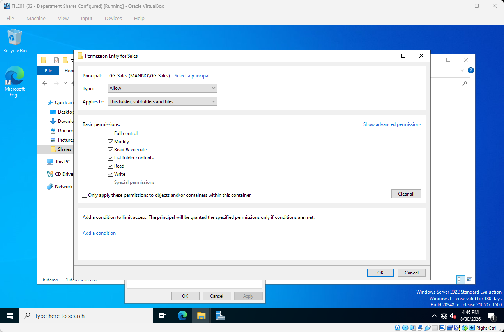
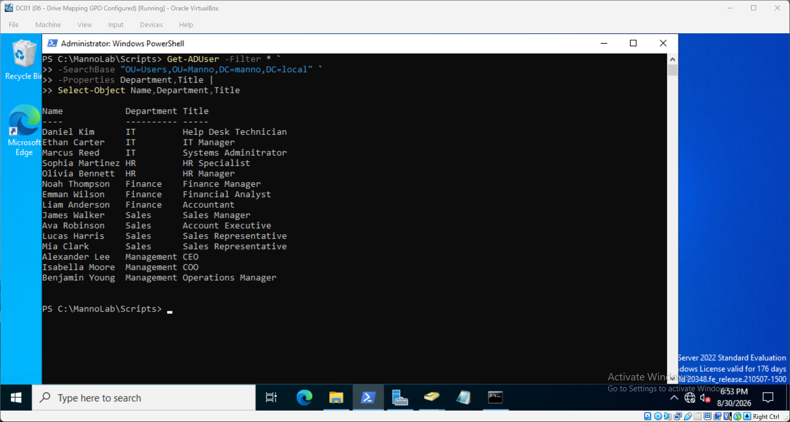

# Windows Active Directory Home Lab

## Overview

This project documents the design, deployment, administration, and troubleshooting of a Windows Active Directory home lab built to simulate a small business IT environment.

The fictional organization, **Manno**, uses a Windows Server 2022 Active Directory domain to centrally manage users, computers, security groups, Group Policy, network drives, and departmental file access.

The lab was built to develop practical experience with Windows system administration, Active Directory, networking, PowerShell, access control, and common IT help desk troubleshooting scenarios.

---

## Lab Environment

| System | Operating System | IP Address | Purpose |
|---|---|---|---|
| DC01 | Windows Server 2022 | 192.168.10.10 | Active Directory, DNS, Group Policy |
| PC01 | Windows 11 Pro | 192.168.10.20 | Domain-joined employee workstation |
| FILE01 | Windows Server 2022 | 192.168.10.30 | Departmental file server |

**Domain:** `manno.local`

**NetBIOS Name:** `MANNO`

**Internal Network:** `192.168.10.0/24`

The virtual environment was created using Oracle VirtualBox with an isolated internal network and separate NAT connectivity for internet access.

---

## Architecture

```text
                     MANNO-LAB
                  192.168.10.0/24
                         |
          +--------------+--------------+
          |              |              |
        DC01           PC01          FILE01
   192.168.10.10  192.168.10.20  192.168.10.30
          |              |              |
   Windows Server     Windows 11    Windows Server
        2022           Pro             2022
          |
     AD DS / DNS
     Group Policy
```
---

## Technologies & Skills
- Windows Server 2022
- Windows 11 Pro
- Active Directory Domain Services
- DNS
- Group Policy
- Group Policy Preferences
- PowerShell
- NTFS permissions
- SMB file sharing
- Active Directory security groups
- Organizational Units
- TCP/IP networking
- VirtualBox virtualization
- Windows Event Viewer
- IT troubleshooting

--- 
## Active Directory Structure
The `manno.local` domain was organized using Organizational Units to separate users, computers, servers, and security groups.

```test
manno.local
|
+-- Manno
    |
    +-- Users
    |   +-- IT
    |   +-- HR
    |   +-- Finance
    |   +-- Sales
    |   +-- Management
    |
    +-- Computers
    |   +-- Workstations
    |   +-- Laptops
    |
    +-- Servers
    |
    +-- Groups
```
### Active Directory Organization



The domain uses Organizational Units to separate users, computers, servers, and administrative groups.
Department security groups include:

- GG-IT
- GG-HR
- GG-Finance
- GG-Sales
- GG-Management
- GG-VPN-Users

Users are organized into department OUs for management and Group Policy application, while security groups are used to control access to resources.

---

## Group Policy

Group Policy was used to centrally manage domain users and workstations.

Configured policies include:

### Workstation Security

`GPO-Workstation-Security`

Applied to domain workstations and used to configure settings such as:

- Machine inactivity timeout
- Interactive logon notice
- Workstation security configuration

### Employee User Policy

`GPO-Employee-User-Policy`

Applied to Manno employee accounts and used to configure user-level restrictions.

### Network Drive Mapping

`GPO-Drive-Mappings`

Group Policy Preferences and item-level targeting automatically map departmental drives according to Active Directory security-group membership.

| Group | Drive | Network Location |
|------|------|----|
| GG-IT | I: | 	`\\FILE01\IT` |
| GG-HR | H: |	`\\FILE01\HR`|
| GG-Finance | F: |	`\\FILE01\Finance` |
| GG-Sales |	S: |	`\\FILE01\Sales` |
| GG-Management | M: |	`\\FILE01\Management` |
| All Employees | P: |	`\\FILE01\Public` |

This allows users to automatically receive the appropriate network resources when they authenticate to a domain workstation.

### Group Policy Management



### Automated Network Drive Mapping



Department drives are mapped using Group Policy Preferences with item-level targeting based on Active Directory security-group membership.



---

## File Server & Access Control

`FILE01` provides centralized departmental file storage.

Configured SMB shares include:

| Share | Primary Access |
|-------|----------------|
| `\\FILE01\IT` |	GG-IT |
| `\\FILE01\HR` |	GG-HR |
| `\\FILE01\Finance` |	GG-Finance |
| `\\FILE01\Sales` |	GG-Sales |
| `\\FILE01\Management` |	GG-Management |
| `\\FILE01\Public` |	Domain Users |

Department groups receive Modify access to their respective folders through NTFS permissions.

Management was also configured with read-only access to selected departmental resources.

The configuration demonstrates the relationship between:

- NTFS permissions
- Active Directory security groups
- Least-privilege access
- SMB share permissions

### Department File Shares



### NTFS Permissions



---

## PowerShell Automation

PowerShell was used to automate common Active Directory administration tasks.

Scripts developed for the lab include:

- Bulk user provisioning from CSV
- Automatic OU placement
- Security-group assignment
- Active Directory user reporting
- Group membership reporting
- Account unlocking
- Account enabling and disabling
- Active Directory environment summaries

Example workflow:
```test
CSV Employee Data
       |
       v
PowerShell Script
       |
       +--> Create AD Account
       |
       +--> Assign Department OU
       |
       +--> Assign Security Group
       |
       v
Employee Account Ready
```

The scripts are available in the `powershell` directory.

### Automated User Provisioning



PowerShell was used to create users, place accounts into the appropriate Organizational Units, and assign department security groups.

---

## Troubleshooting Scenarios

The lab includes intentionally created failures designed to simulate common help desk and Windows administration incidents.

| Incident| Problem| Root Cause| 
|---|---|---|
| INC-001 | User unable to log in | Account lockout |
| INC-002 | Department share inaccessible | Missing NTFS group permission |
| INC-003 | Department drive missing | Incorrect security-group membership |
| INC-004 | Workstation GPO not applying | Computer placed in incorrect OU |
| INC-005 | Domain resources unavailable | Incorrect client DNS configuration |
| INC-006 | Employee cannot authenticate | Disabled Active Directory account |

Troubleshooting involved tools and commands including:

- ipconfig /all
- nslookup
- ping
- Test-NetConnection
- whoami
- whoami /groups
- gpupdate
- gpresult
- net use
- Get-ADUser
- Search-ADAccount
- Windows Event Viewer

Each incident is documented using:

#### Problem → Symptoms → Investigation → Root Cause → Resolution → Verification

Detailed incident documentation is available in `docs/troubleshooting`.

---

## Domain Security

Domain-level account policies were configured to simulate a managed business environment.

The lab includes:

- Password complexity requirements
- Minimum password length
- Password history
- Password expiration
- Account lockout threshold
- Account lockout duration

Account lockout scenarios were then intentionally generated and investigated using Active Directory, PowerShell, and Windows security events.

---

## Project Structure
```text
windows-active-directory-home-lab/
|
+-- README.md
|
+-- docs/
|   +-- troubleshooting/
|
+-- powershell/
|
+-- data/
|
+-- diagrams/
|
+-- screenshots/
    +-- active-directory/
    +-- group-policy/
    +-- file-server/
    +-- powershell/
    +-- troubleshooting/
```
